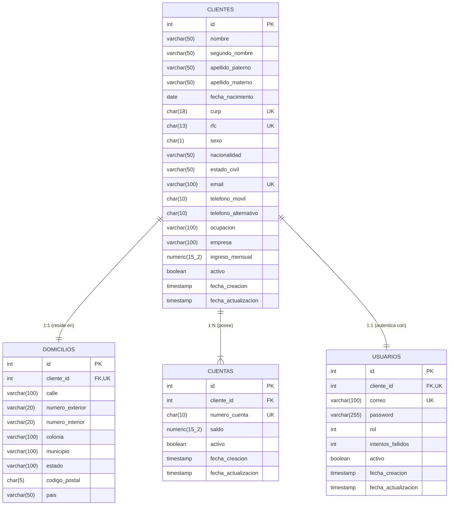

# Documentación Técnica: Proyecto Integrador - Onboarding de Clientes Personas Físicas

## 1. Introducción y Objetivo
El proyecto implementa un sistema bancario integral de **Onboarding de Clientes Personas Físicas** bajo arquitectura de microservicios / API REST con **Java 17**, **Spring Boot 3**, **Spring Data JPA**, **Flyway**, **MapStruct**, **BCrypt** y **PostgreSQL**.

Permite capturar y validar rigurosamente la información del cliente, generar automáticamente su cuenta bancaria de 10 dígitos con saldo inicial, aprovisionar su usuario de acceso con contraseña cifrada y roles, gestionar sesiones mediante **JWT**, aplicar baja lógica en cascada y aplicar bloqueo de seguridad tras 3 intentos fallidos.

---

## 2. Decisiones de Diseño y Buenas Prácticas

### 2.1. Tipos de Datos y Optimización de Memoria (SQL & JPA)
Siguiendo las mejores prácticas de bases de datos para rendimiento e integridad:
- **Longitud fija (`CHAR(n)`)**: Se emplean para campos con formato exacto e inmutable:
  - `CURP`: `CHAR(18)`
  - `RFC`: `CHAR(13)`
  - `telefono_movil` y `telefono_alternativo`: `CHAR(10)`
  - `numero_cuenta`: `CHAR(10)`
  - `codigo_postal`: `CHAR(5)`
  - `sexo`: `CHAR(1)` (`'H'`, `'M'`, `'X'`)
- **Montos Monetarios (`NUMERIC(15,2)` y `BigDecimal`)**: Garantizan precisión decimal exacta sin los errores de redondeo inherentes a `Double` o `Float`.
- **Estatus Booleano Binario (`activo BOOLEAN NOT NULL DEFAULT TRUE`)**: Simplifica y optimiza el estado en `cuentas` y `usuarios` en lugar de cadenas de texto variables.
- **Roles Numéricos (`rol INTEGER NOT NULL DEFAULT 2`)**:
  - `1` = **ADMIN** (Acceso a paginación, desbloqueo de usuarios, consultas globales).
  - `2` = **CLIENTE** (Rol asignado automáticamente al registrarse).

### 2.2. Estandarización del Campo Sexo (`H`, `M`, `X`)
En lugar de cadenas libres como `"Hombre"` o `"Mujer"`, se estandarizó a 1 caracter:
- `'H'`: Hombre / Masculino
- `'M'`: Mujer / Femenino
- `'X'`: No binario / Prefiero no especificar
- **Validación**: Validado a nivel API con `@Pattern(regexp = "^[HMX]$")` y a nivel BD con `CHECK (sexo IN ('H', 'M', 'X'))`.

### 2.3. Sanitización Declarativa con MapStruct
Para evitar código espagueti con múltiples `if (cadena != null) trim()`, se implementó el componente [StringSanitizer.java](file:///c:/Users/marco/Downloads/10/aplicaciones_web_progresivas/backend/prueba/src/main/java/com/proyecto/servicios/mapper/StringSanitizer.java) con `@Named`:
- `@Named("trim")`: Limpia espacios en blanco.
- `@Named("trimUpper")`: Limpia espacios y convierte a mayúsculas (CURP, RFC, Sexo).
- `@Named("trimLower")`: Limpia espacios y convierte a minúsculas (Email).

---

## 3. Diagrama Entidad-Relación (ER)



---

## 4. Seguridad, JWT y Reglas de Bloqueo

### 4.1. Intentos Fallidos y Bloqueo de Cuenta
- **Límite**: Al registrarse, el usuario inicia con `intentos_fallidos = 0` y `activo = true`.
- **Fallo de contraseña**: Cada intento erróneo incrementa el contador (`1/3`, `2/3`).
- **Al 3er fallo consecutivo**:
  - El sistema actualiza `activo = false` e `intentos_fallidos = 3`.
  - Se deniega el acceso con `HTTP 403 FORBIDDEN` y código `AUTH-002`:
    > *"Acceso bloqueado: ha excedido el límite de 3 intentos fallidos de contraseña. Por favor, contacte al administrador para desbloquear su cuenta."*
- **Desbloqueo**: El administrador invoca `PATCH /usuarios/{id}/desbloquear`, restableciendo `activo = true` e `intentos_fallidos = 0`.
- **Éxito**: Un inicio de sesión correcto resetea `intentos_fallidos = 0`.

### 4.2. Baja Lógica en Cascada
Al dar de baja a un cliente mediante `DELETE /clientes/{id}`:
1. `cliente.activo = false`
2. Todas sus cuentas vinculadas pasan a `cuenta.activo = false`.
3. Su usuario de acceso pasa a `usuario.activo = false`.
4. Si el usuario intenta hacer login, la API rechaza el acceso (`HTTP 403 Forbidden`).

---

## 5. Catálogo de Endpoints de la API REST

### 5.1. Autenticación (`/auth`)
| Método | Endpoint | Acceso | Descripción |
| :--- | :--- | :--- | :--- |
| `POST` | `/auth/login` | Público | Autentica con correo y contraseña. Devuelve token JWT, rol y datos de sesión. |

#### Credenciales Predeterminadas para Pruebas:
| Rol | Correo / Usuario | Contraseña | Notas |
| :--- | :--- | :--- | :--- |
| **Administrador** | `admin@banco.com` | `Admin123!` | Creado por migración Flyway `V4`. Acceso total a listados, filtros, métricas y desbloqueo. |
| **Cliente (Ejemplo)** | `juan.perez@example.com` | `Password123!` | Se crea al registrarse con `POST /clientes`. Acceso exclusivo a `/clientes/me`, `/cuentas/me` y sus cuentas. |

#### Ejemplo Request `/auth/login` (Login como Administrador):
```json
{
  "correo": "admin@banco.com",
  "password": "Admin123!"
}
```

#### Ejemplo Response 200 OK (Administrador):
```json
{
  "token": "eyJhbGciOiJIUzI1NiJ9...",
  "tokenType": "Bearer",
  "usuarioId": 1,
  "clienteId": null,
  "correo": "admin@banco.com",
  "rol": 1
}
```

---

### 5.2. Clientes (`/clientes`)
| Método | Endpoint | Acceso Requerido | Descripción |
| :--- | :--- | :--- | :--- |
| `POST` | `/clientes` | Público | **Onboarding completo**: Registra cliente, domicilio, genera cuenta bancaria (10 dígitos) con saldo inicial `$0.00` y usuario. |
| `GET` | `/clientes/me` | Cliente / Administrador | Obtiene el perfil propio del cliente asociado al token JWT autenticado. |
| `GET` | `/clientes` | **Solo Administrador** | Lista todos los clientes o filtra por `filtro`, `curp`, `rfc`, `email`, `cuenta`. |
| `GET` | `/clientes/paginados` | **Solo Administrador** | Consulta paginada (`page`, `size`, `sort`) para paneles administrativos. |
| `GET` | `/clientes/activos` | **Solo Administrador** | Lista todos los clientes con `activo = true`. |
| `GET` | `/clientes/{id}` | **Solo Administrador** | Obtiene detalle de cualquier cliente por su ID. |
| `GET` | `/clientes/curp/{curp}` | **Solo Administrador** | Búsqueda parcial de clientes por CURP. |
| `GET` | `/clientes/rfc/{rfc}` | **Solo Administrador** | Búsqueda parcial de clientes por RFC. |
| `GET` | `/clientes/correo/{correo}` | **Solo Administrador** | Búsqueda parcial de clientes por correo electrónico. |
| `GET` | `/clientes/cuenta/{numeroCuenta}` | **Solo Administrador** | Obtiene el cliente titular del número de cuenta. |
| `GET` | `/clientes/rango-fechas` | **Solo Administrador** | Filtra clientes dados de alta en un rango de fechas (`YYYY-MM-DD`). |
| `GET` | `/clientes/buscar?filtro=texto` | **Solo Administrador** | Búsqueda abierta en nombres, CURP, RFC, email o cuenta. |
| `PUT` | `/clientes/{id}` | **Administrador o Propio Cliente** | Actualiza datos personales y de domicilio (Valida IDOR: el cliente solo puede modificar su propio ID). |
| `DELETE` | `/clientes/{id}` | **Solo Administrador** | **Baja lógica en cascada** (desactiva cliente, cuentas y usuario). |

---

### 5.3. Cuentas (`/cuentas`)
| Método | Endpoint | Acceso Requerido | Descripción |
| :--- | :--- | :--- | :--- |
| `GET` | `/cuentas/me` | Cliente / Administrador | Obtiene el listado de cuentas activas pertenecientes al cliente autenticado. |
| `GET` | `/cuentas/{numeroCuenta}` | **Administrador o Dueño de Cuenta** | Consulta detalle de la cuenta (Valida pertenencia para el cliente, IDOR protegido). |
| `GET` | `/cuentas/{numeroCuenta}/saldo` | **Administrador o Dueño de Cuenta** | Consulta el saldo actual de la cuenta (Valida pertenencia para el cliente, IDOR protegido). |
| `GET` | `/cuentas/activas` | **Solo Administrador** | Lista global de todas las cuentas bancarias activas en el sistema. |

---

### 5.4. Usuarios (`/usuarios`)
| Método | Endpoint | Acceso Requerido | Descripción |
| :--- | :--- | :--- | :--- |
| `GET` | `/usuarios/{id}` | **Solo Administrador** | Obtiene la información técnica del usuario (ID, correo, rol, intentos, activo). |
| `PUT` | `/usuarios/{id}/password` | **Exclusivo Propio Usuario** | Cambia la contraseña (requiere `passwordActual` y `passwordNuevo`). **Protección IDOR estricta**: solo el usuario autenticado puede cambiar su propia clave. |
| `PATCH` | `/usuarios/{id}/desbloquear` | **Solo Administrador** | Desbloquea un usuario tras 3 intentos fallidos (`activo = true`, `intentos = 0`). |

---

## 6. Formato Estructurado de Errores y Validaciones

Cuando una petición no cumple las restricciones (por ejemplo, `POST /clientes` con datos erróneos), [`GlobalExceptionHandler.java`](file:///c:/Users/marco/Downloads/10/aplicaciones_web_progresivas/backend/prueba/src/main/java/com/proyecto/servicios/exception/GlobalExceptionHandler.java) devuelve un JSON estructurado con el desglose exacto de cada campo fallido:

#### Respuesta HTTP 400 Bad Request (`VALIDACION-001`):
```json
{
  "codigo": "VALIDACION-001",
  "mensaje": "El sexo debe ser 'H' (Hombre), 'M' (Mujer) o 'X' (No binario); El RFC para persona física debe cumplir el formato oficial AAAA000000XXX (13 caracteres)",
  "detalles": {
    "sexo": "El sexo debe ser 'H' (Hombre), 'M' (Mujer) o 'X' (No binario)",
    "rfc": "El RFC para persona física debe cumplir el formato oficial AAAA000000XXX (13 caracteres)",
    "telefonoMovil": "El teléfono móvil debe contener exactamente 10 dígitos numéricos"
  },
  "timestamp": "2026-10-06T00:45:00",
  "path": "/clientes"
}
```

### Tabla de Códigos de Excepciones de Negocio
| Código | HTTP Status | Excepción | Motivo |
| :--- | :--- | :--- | :--- |
| `VALIDACION-001` | `400 BAD REQUEST` | `MethodArgumentNotValidException` | Error en campos del DTO (formato, tamaño, regex). |
| `VALIDACION-002` | `400 BAD REQUEST` | `ValidacionException` | El cliente es menor de 18 años. |
| `VALIDACION-003` | `400 BAD REQUEST` | `ValidacionException` | El saldo inicial es negativo. |
| `CLIENTE-002` | `409 CONFLICT` | `CurpDuplicadaException` | La CURP ya se encuentra registrada. |
| `CLIENTE-003` | `409 CONFLICT` | `RfcDuplicadoException` | El RFC ya se encuentra registrado. |
| `CLIENTE-004` | `409 CONFLICT` | `CorreoDuplicadoException` | El correo electrónico ya pertenece a otro cliente/usuario. |
| `CLIENTE-005` | `404 NOT FOUND` | `ClienteNoEncontradoException` | No existe cliente con el ID, CURP o RFC consultado. |
| `CUENTA-001` | `404 NOT FOUND` | `CuentaNoEncontradaException` | No se encontró la cuenta con el número especificado. |
| `AUTH-001` | `404 NOT FOUND` | `UsuarioNoEncontradoException` | Usuario no localizado por ID o correo. |
| `AUTH-002` | `403 FORBIDDEN` | `UsuarioInactivoException` | Usuario inactivo o bloqueado tras 3 intentos fallidos. |
| `AUTH-003` | `401 UNAUTHORIZED` | `CredencialesInvalidasException` | Contraseña incorrecta. |
| `AUTH-004` | `400 BAD REQUEST` | `ContrasenaInvalidaException` | Contraseña actual errónea o nueva contraseña repetida. |

---

## 7. Evidencia y Cobertura de Pruebas Unitarias

Se cuenta con **más de 118 casos de prueba automatizados** ejecutados mediante JUnit 5 y Mockito:
- [ClienteValidationTest.java](file:///c:/Users/marco/Downloads/10/aplicaciones_web_progresivas/backend/prueba/src/test/java/com/proyecto/servicios/validation/ClienteValidationTest.java): Pruebas parametrizadas de todas las restricciones negativas (RFCs de 12/14 dígitos, teléfonos con letras, nombres con números/puntos, contraseñas débiles, etc.).
- [ClienteCicloVidaTest.java](file:///c:/Users/marco/Downloads/10/aplicaciones_web_progresivas/backend/prueba/src/test/java/com/proyecto/servicios/service/Impl/ClienteCicloVidaTest.java): Pruebas de integración de ciclo de vida completo: Registro -> Login exitoso -> Baja lógica -> Rechazo de login post-baja -> Bloqueo al 3er fallo -> Desbloqueo por Administrador.
- [ClienteServiceImplTest.java](file:///c:/Users/marco/Downloads/10/aplicaciones_web_progresivas/backend/prueba/src/test/java/com/proyecto/servicios/service/Impl/ClienteServiceImplTest.java): Pruebas de lógica de servicios, inmutabilidad de CURP/RFC y filtros.
- [AuthServiceImplTest.java](file:///c:/Users/marco/Downloads/10/aplicaciones_web_progresivas/backend/prueba/src/test/java/com/proyecto/servicios/service/Impl/AuthServiceImplTest.java): Pruebas de login y JWT.
- [CuentaServiceImplTest.java](file:///c:/Users/marco/Downloads/10/aplicaciones_web_progresivas/backend/prueba/src/test/java/com/proyecto/servicios/service/Impl/CuentaServiceImplTest.java): Pruebas de consulta de saldos y números de cuenta.
- [UsuarioServiceImplTest.java](file:///c:/Users/marco/Downloads/10/aplicaciones_web_progresivas/backend/prueba/src/test/java/com/proyecto/servicios/service/Impl/UsuarioServiceImplTest.java): Pruebas de cambio de contraseña y desbloqueo.

**Estado de Ejecución**: `./gradlew.bat test` -> **`BUILD SUCCESSFUL (0 fallos, 0 errores)`**.
