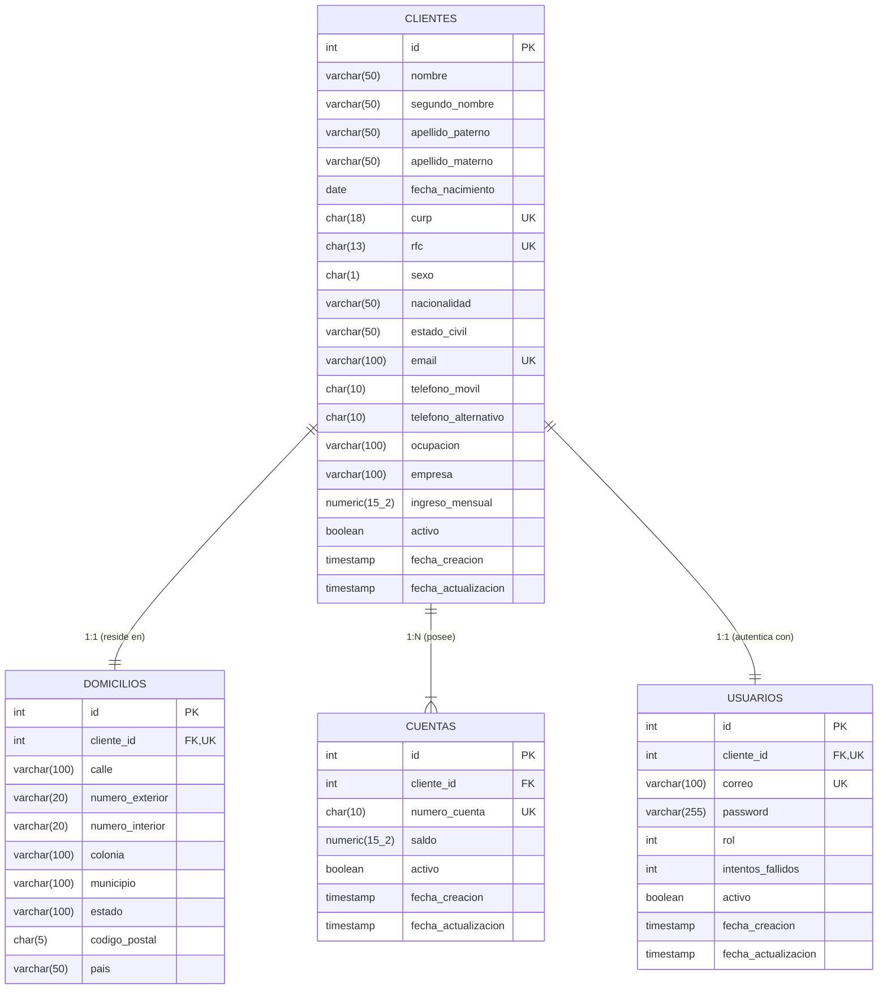
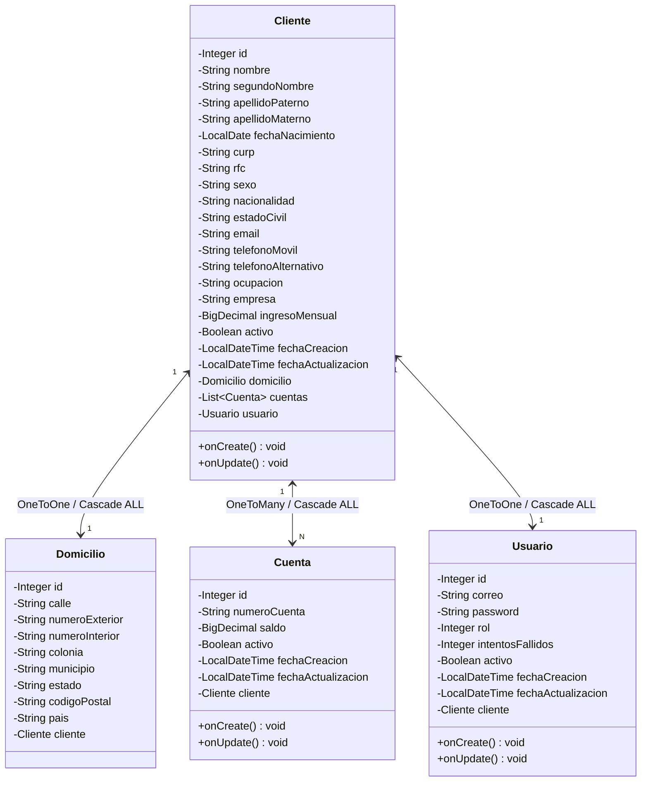

# Documentación Técnica: Proyecto Integrador - Onboarding de Clientes Personas Físicas

## 1. Introducción y Resumen Ejecutivo
El proyecto implementa un sistema bancario integral para el **Onboarding de Clientes Personas Físicas** bajo una arquitectura de microservicios / API REST empresarial con **Java 21**, **Spring Boot 3**, **Spring Data JPA**, **Flyway**, **MapStruct**, **BCrypt** y **PostgreSQL**.

Permite capturar y validar rigurosamente la información del cliente, generar automáticamente su cuenta bancaria de 10 dígitos con saldo inicial en `$0.00`, aprovisionar su usuario de acceso con credenciales cifradas y roles, gestionar sesiones mediante **JWT**, aplicar baja y reactivación lógica en cascada, controlar permisos mediante **RBAC** y proteger contra vulnerabilidades de control de acceso **IDOR**.

---

## 2. Entregables del Proyecto
1. **Diagrama Entidad-Relación (Base de Datos)**: Esquema relacional con llaves primarias, foráneas, restricciones de unicidad (`UNIQUE`) y checks.
2. **Diagrama de Clases y Entidades JPA (Java)**: Modelado orientado a objetos con tipos de datos, relaciones bidireccionales y cascadas.
3. **Scripts de Base de Datos Versionados con Flyway**:
   - `src/main/resources/db/migration/V3__create_onboarding_clientes_cuentas_usuarios.sql` (Estructura DDL).
   - `src/main/resources/db/migration/V4__insert_admin_default.sql` (Semilla DML de Administrador).
4. **Código Fuente Completo**: Arquitectura en capas limpia (Controladores, Servicios, Repositorios, DTOs, Mappers y Seguridad).
5. **API REST Funcional**: Catálogo completo de endpoints con validaciones estrictas y códigos de estado HTTP semánticos.
6. **Evidencias y Reportes de Pruebas Automatizadas**: Suite con más de 125 pruebas unitarias y de integración con 100% de éxito y reporte interactivo HTML generado por Gradle.
7. **Documento Técnico de Arquitectura y Solución**: Esta especificación detallada.

---

## 3. Decisiones de Diseño y Buenas Prácticas

### 3.1. Tipos de Datos y Optimización en Base de Datos (PostgreSQL & JPA)
- **Longitud fija (`CHAR(n)`)**: Para campos estandarizados de longitud inmutable:
  - `curp`: `CHAR(18)`
  - `rfc`: `CHAR(13)`
  - `telefono_movil` y `telefono_alternativo`: `CHAR(10)`
  - `numero_cuenta`: `CHAR(10)`
  - `codigo_postal`: `CHAR(5)`
  - `sexo`: `CHAR(1)` (`'H'`, `'M'`, `'X'`)
- **Montos Monetarios (`NUMERIC(15,2)` y `BigDecimal`)**: Garantizan precisión decimal exacta sin pérdida de precisión de punto flotante. Saldo inicial fijado por el sistema en `$0.00`.
- **Estatus Booleano Binario (`activo BOOLEAN NOT NULL DEFAULT TRUE`)**: Optimiza el estado en `cuentas`, `clientes` y `usuarios`.
- **Roles Numéricos (`rol INTEGER NOT NULL DEFAULT 2`)**:
  - `1` = **Administrador** (Acceso global, consultas, desbloqueo y reactivación).
  - `2` = **Cliente** (Rol asignado al registrarse, acceso a su propio perfil y cuentas).

### 3.2. Estandarización del Campo Sexo (`H`, `M`, `X`)
- `'H'`: Hombre / Masculino
- `'M'`: Mujer / Femenino
- `'X'`: No binario / Prefiero no especificar
- **Validaciones**: API con `@Pattern(regexp = "^[hmxHMX]$")` y Base de Datos con `CHECK (sexo IN ('H', 'M', 'X'))`.

### 3.3. Sanitización Declarativa con MapStruct
Para evitar código repetitivo de limpieza de cadenas (`trim`), se implementó el componente `StringSanitizer.java` (`src/main/java/com/proyecto/servicios/mapper/StringSanitizer.java`):
- `@Named("trim")`: Limpia espacios en blanco iniciales y finales.
- `@Named("trimUpper")`: Limpia espacios y convierte automáticamente a mayúsculas (CURP, RFC, Sexo).
- `@Named("trimLower")`: Limpia espacios y convierte a minúsculas (Email).

---

## 4. Diagramas del Sistema

### 4.1. Diagrama Entidad-Relación (Base de Datos)


### 4.2. Diagrama de Clases y Entidades JPA (Java)


---

## 5. Seguridad, RBAC, JWT y Reglas de Negocio

### 5.1. Control de Acceso Basado en Roles (RBAC) y Prevención IDOR
- **Administrador (`rol = 1`)**: Tiene privilegios para listar todos los clientes, ver cuentas activas, paginación, filtros globales, bajas, desbloqueo de credenciales y reactivación.
- **Cliente (`rol = 2`)**: Acceso exclusivo a `/clientes/me`, `/cuentas/me` y únicamente a sus propias cuentas bancarias.
- **Prevención IDOR en Contraseñas (`PUT /usuarios/{id}/password`)**: Exclusivo para el propio usuario autenticado (`tokenUsuarioId == id`). Ni siquiera un administrador u otro usuario pueden cambiar la clave de un tercero mediante este endpoint.

### 5.2. Reglas de Bloqueo por Intentos Fallidos
- **Al 3er fallo consecutivo de contraseña**:
  - El sistema actualiza `activo = false` e `intentos_fallidos = 3`.
  - Se deniega el acceso con `HTTP 403 Forbidden` (`AUTH-002`).
- **Desbloqueo**: El administrador invoca `PATCH /usuarios/{id}/desbloquear`, restableciendo `activo = true` e `intentos_fallidos = 0`.
- **Éxito**: Un inicio de sesión correcto resetea automáticamente `intentos_fallidos = 0`.

### 5.3. Baja Lógica y Reactivación en Cascada
- **Baja Lógica (`DELETE /clientes/{id}`)**: Desactiva en cascada al cliente (`activo = false`), sus cuentas asociadas y su usuario.
- **Reactivación (`PATCH /clientes/{id}/reactivar`)**: Reactiva en cascada al cliente (`activo = true`), sus cuentas y su usuario con `intentos_fallidos = 0`.

---

## 6. Catálogo de Endpoints de la API REST

### 6.1. Autenticación (`/auth`)
| Método | Endpoint | Acceso Requerido | Descripción |
| :--- | :--- | :--- | :--- |
| `POST` | `/auth/login` | Público | Autentica con correo y contraseña. Devuelve token JWT, rol y datos de sesión. |

#### Credenciales Predeterminadas para Pruebas:
| Rol | Correo / Usuario | Contraseña | Notas |
| :--- | :--- | :--- | :--- |
| **Administrador** | `admin@banco.com` | `Admin123!` | Generado por migración Flyway `V4`. Permisos completos del sistema. |
| **Cliente** | *(Correo ingresado al registrarse)* | *(Contraseña del registro)* | Acceso a `/clientes/me`, `/cuentas/me` y cambio de su propia clave. |

---

### 6.2. Clientes (`/clientes`)
| Método | Endpoint | Acceso Requerido | Descripción |
| :--- | :--- | :--- | :--- |
| `POST` | `/clientes` | Público | **Onboarding completo**: Registra cliente, domicilio, genera cuenta bancaria (10 dígitos) con saldo inicial `$0.00` y usuario. |
| `GET` | `/clientes/me` | Cliente / Administrador | Obtiene el perfil propio del cliente asociado al token JWT autenticado. |
| `GET` | `/clientes` | **Solo Administrador** | Lista todos los clientes o filtra por `filtro`, `curp`, `rfc`, `email`, `cuenta`. |
| `GET` | `/clientes/paginados` | **Solo Administrador** | Consulta paginada (`page`, `size`, `sort`) para paneles administrativos. |
| `GET` | `/clientes/activos` | **Solo Administrador** | Lista todos los clientes con `activo = true`. |
| `GET` | `/clientes/{id}` | **Solo Administrador** | Obtiene detalle de cualquier cliente por su ID. |
| `GET` | `/clientes/curp/{curp}` | **Solo Administrador** | Búsqueda parcial de clientes por CURP. |
| `GET` | `/clientes/rfc/{rfc}` | **Solo Administrador** | Búsqueda parcial de clientes por RFC. |
| `GET` | `/clientes/correo/{correo}` | **Solo Administrador** | Búsqueda parcial de clientes por correo electrónico. |
| `GET` | `/clientes/cuenta/{numeroCuenta}` | **Solo Administrador** | Obtiene el cliente titular del número de cuenta. |
| `GET` | `/clientes/rango-fechas` | **Solo Administrador** | Filtra clientes dados de alta en un rango de fechas (`YYYY-MM-DD`). |
| `GET` | `/clientes/buscar?filtro=texto` | **Solo Administrador** | Búsqueda abierta en nombres, CURP, RFC, email o cuenta. |
| `PUT` | `/clientes/{id}` | **Administrador o Propio Cliente** | Actualiza datos personales y de domicilio (Valida IDOR: el cliente solo puede modificar su propio ID). |
| `DELETE` | `/clientes/{id}` | **Solo Administrador** | **Baja lógica en cascada** (desactiva cliente, cuentas y usuario). |
| `PATCH` | `/clientes/{id}/reactivar` | **Solo Administrador** | **Reactivación en cascada** (reactiva cliente, cuentas y usuario, reseteando fallos a 0). |

---

### 6.3. Cuentas (`/cuentas`)
| Método | Endpoint | Acceso Requerido | Descripción |
| :--- | :--- | :--- | :--- |
| `GET` | `/cuentas/me` | Cliente / Administrador | Obtiene el listado de cuentas activas pertenecientes al cliente autenticado. |
| `GET` | `/cuentas/{numeroCuenta}` | **Administrador o Dueño de Cuenta** | Consulta detalle de la cuenta (Valida pertenencia para el cliente, IDOR protegido). |
| `GET` | `/cuentas/{numeroCuenta}/saldo` | **Administrador o Dueño de Cuenta** | Consulta el saldo actual de la cuenta (Valida pertenencia para el cliente, IDOR protegido). |
| `GET` | `/cuentas/activas` | **Solo Administrador** | Lista global de todas las cuentas bancarias activas en el sistema. |

---

### 6.4. Usuarios (`/usuarios`)
| Método | Endpoint | Acceso Requerido | Descripción |
| :--- | :--- | :--- | :--- |
| `GET` | `/usuarios/{id}` | **Solo Administrador** | Obtiene la información técnica del usuario (ID, correo, rol, intentos, activo). |
| `PUT` | `/usuarios/{id}/password` | **Exclusivo Propio Usuario** | Cambia la contraseña (requiere `passwordActual` y `passwordNuevo`). **Protección IDOR estricta**: solo el usuario autenticado puede cambiar su propia clave. |
| `PATCH` | `/usuarios/{id}/desbloquear` | **Solo Administrador** | Desbloquea un usuario tras 3 intentos fallidos (`activo = true`, `intentos = 0`). |

---

## 7. Formato Estructurado de Errores y Validaciones
Cuando una petición no cumple las restricciones (por ejemplo, `POST /clientes` con datos erróneos), el controlador global de excepciones `GlobalExceptionHandler.java` (`src/main/java/com/proyecto/servicios/exception/GlobalExceptionHandler.java`) devuelve un JSON estructurado con el desglose exacto de cada campo fallido:

#### Ejemplo Respuesta HTTP 400 Bad Request (`VALIDACION-001`):
```json
{
  "codigo": "VALIDACION-001",
  "mensaje": "El sexo debe ser 'H' (Hombre), 'M' (Mujer) o 'X' (No binario); El RFC para persona física debe cumplir el formato oficial AAAA000000XXX (13 caracteres)",
  "detalles": {
    "sexo": "El sexo debe ser 'H' (Hombre), 'M' (Mujer) o 'X' (No binario)",
    "rfc": "El RFC para persona física debe cumplir el formato oficial AAAA000000XXX (13 caracteres)",
    "telefonoMovil": "El teléfono móvil es inválido: solo debe contener exactamente 10 dígitos numéricos (sin letras, espacios ni caracteres especiales)"
  },
  "timestamp": "2026-10-09T03:00:00",
  "path": "/clientes"
}
```

### Tabla de Códigos de Error de la API
| Código | HTTP Status | Excepción | Motivo |
| :--- | :--- | :--- | :--- |
| `VALIDACION-001` | `400 BAD REQUEST` | `MethodArgumentNotValidException` | Error de validación en campos del DTO (formato, tamaño, regex). |
| `VALIDACION-002` | `400 BAD REQUEST` | `ValidacionException` | El cliente es menor de 18 años. |
| `CLIENTE-002` | `409 CONFLICT` | `CurpDuplicadaException` | La CURP ya se encuentra registrada en la base de datos. |
| `CLIENTE-003` | `409 CONFLICT` | `RfcDuplicadoException` | El RFC ya se encuentra registrado en la base de datos. |
| `CLIENTE-004` | `409 CONFLICT` | `CorreoDuplicadoException` | El correo electrónico ya pertenece a otro cliente/usuario. |
| `CLIENTE-005` | `404 NOT FOUND` | `ClienteNoEncontradoException` | No existe cliente con el ID, CURP o RFC consultado. |
| `CUENTA-001` | `404 NOT FOUND` | `CuentaNoEncontradaException` | No se encontró la cuenta bancaria con el número especificado. |
| `AUTH-001` | `404 NOT FOUND` | `UsuarioNoEncontradoException` | Usuario no localizado por ID o correo. |
| `AUTH-002` | `403 FORBIDDEN` | `UsuarioInactivoException` | Usuario inactivo o bloqueado tras 3 intentos fallidos. |
| `AUTH-003` | `401 UNAUTHORIZED` | `CredencialesInvalidasException` | Contraseña incorrecta o token faltante/inválido. |
| `AUTH-004` | `403 FORBIDDEN` | `AccesoDenegadoException` | Acceso denegado: Se requieren permisos de Administrador o el recurso no le pertenece. |
| `AUTH-007` | `403 FORBIDDEN` | `AccesoDenegadoException` | Acceso denegado: Solo el propio usuario autenticado puede modificar su contraseña (IDOR). |
| `AUTH-008` | `403 FORBIDDEN` | `AccesoDenegadoException` | Acceso denegado: Solo un administrador puede desbloquear usuarios. |

---

## 8. Evidencia y Cobertura de Pruebas Automatizadas

La solución cuenta con una suite completa de pruebas unitarias y de integración desarrolladas con **JUnit 5**, **Mockito** y **Spring Boot Test**:

### 8.1. Matriz de Módulos de Prueba
| Módulo / Clase de Prueba | Ubicación en el Proyecto | Casos / Escenarios Cubiertos | Cobertura |
| :--- | :--- | :--- | :---: |
| **ClienteValidationTest** | `src/test/java/com/proyecto/servicios/validation/ClienteValidationTest.java` | Pruebas parametrizadas de todas las restricciones negativas (RFC 12/14 dígitos, CURP inválida, teléfonos con letras/espacios, nombres con números/símbolos, contraseñas débiles, minoría de edad, supresión de espacios y auto-sanitización). | **100% Casos Límite** |
| **ClienteCicloVidaTest** | `src/test/java/com/proyecto/servicios/service/Impl/ClienteCicloVidaTest.java` | Flujo de integración de ciclo de vida completo: Registro -> Login exitoso -> Baja lógica en cascada -> Rechazo de login post-baja -> Bloqueo automático al 3er intento fallido -> Desbloqueo por Admin -> Reactivación en cascada. | **100% Ciclo de Vida** |
| **RbacSecurityTest** | `src/test/java/com/proyecto/servicios/security/RbacSecurityTest.java` | Pruebas de autorización por roles (Admin vs Cliente), validación de endpoints protegidos y prevención estricta de IDOR en cambio de password y consulta de cuentas. | **100% Seguridad RBAC/IDOR** |
| **ClienteServiceImplTest** | `src/test/java/com/proyecto/servicios/service/Impl/ClienteServiceImplTest.java` | Pruebas de lógica de negocio del servicio de clientes: registro, inmutabilidad de RFC/CURP, filtros generales, búsquedas por fechas y duplicados. | **100% Lógica Negocio** |
| **AuthServiceImplTest** | `src/test/java/com/proyecto/servicios/service/Impl/AuthServiceImplTest.java` | Generación y validación de tokens JWT, login de usuarios activos, bloqueo por intentos y manejo de credenciales inválidas. | **100% Autenticación** |
| **CuentaServiceImplTest** | `src/test/java/com/proyecto/servicios/service/Impl/CuentaServiceImplTest.java` | Consulta de números de cuenta de 10 dígitos, consulta de saldos y listado de cuentas activas. | **100% Cuentas** |
| **UsuarioServiceImplTest** | `src/test/java/com/proyecto/servicios/service/Impl/UsuarioServiceImplTest.java` | Cambio de contraseña con validación de contraseña actual y hash BCrypt, desbloqueo de usuarios. | **100% Usuarios** |

---

### 8.2. Cómo Ejecutar y Evidenciar las Pruebas Automatizadas

#### 1. Ejecutar toda la suite completa desde la terminal:
```bash
.\gradlew.bat test
```

#### 2. Ejecutar clases específicas de prueba:
```bash
# Ejecuta solo las pruebas de validaciones de restricciones negativas (RFC, CURP, Teléfono, etc.):
.\gradlew.bat test --tests com.proyecto.servicios.validation.ClienteValidationTest

# Ejecuta el ciclo de vida completo (Registro -> Baja lógica -> Bloqueo 3 intentos -> Desbloqueo -> Reactivación):
.\gradlew.bat test --tests com.proyecto.servicios.service.Impl.ClienteCicloVidaTest

# Ejecuta las pruebas de Control de Acceso (RBAC) y Prevención IDOR:
.\gradlew.bat test --tests com.proyecto.servicios.security.RbacSecurityTest
```

#### 3. Generar y abrir el reporte visual de evidencias (HTML):
Al ejecutar las pruebas, Gradle genera automáticamente el informe de resultados en formato web. Para abrirlo directamente en el navegador:
```bash
start .\build\reports\tests\test\index.html
```

#### 4. Ubicación de los archivos de resultados y evidencias:
- **Reporte Visual Interactivo (HTML)**: `build/reports/tests/test/index.html` (desglose por paquetes, clases, métodos y tiempos de ejecución).
- **Archivos XML de Resultados JUnit**: `build/test-results/test/` (archivos `.xml` estándar para integración continua o evidencias de auditoría).
