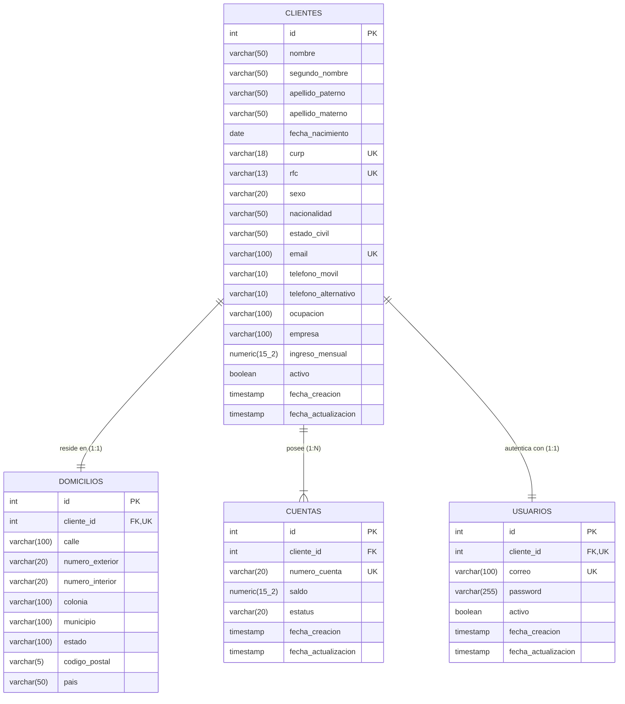

# Documento Técnico: Proyecto Integrador - Onboarding de Clientes Personas Físicas

## 1. Introducción y Objetivo
El objetivo de este proyecto es implementar un sistema de **Onboarding de Clientes Personas Físicas** para una institución financiera, permitiendo registrar clientes, validar rigurosamente su información y reglas de negocio, crear automáticamente una cuenta bancaria con saldo inicial y estatus activo, crear automáticamente un usuario con contraseña cifrada en BCrypt y generar tokens JWT para el consumo seguro de la API REST.

---

## 2. Diagrama Entidad-Relación (ER)

---

## 3. Script de Base de Datos (Flyway V3)
Ubicación: `src/main/resources/db/migration/V3__create_onboarding_clientes_cuentas_usuarios.sql`

* **Tipos de datos optimizados**: `NUMERIC(15,2)` para cantidades monetarias precisas evitando errores de punto flotante (`Double/Float`); `VARCHAR` con longitudes acotadas para optimizar almacenamiento en disco e índices; `DATE` para fecha de nacimiento; `TIMESTAMP` para trazabilidad de auditoría.
* **Integridad referencial y restricciones**: Llaves primarias autoincrementales, restricciones `UNIQUE` en `curp`, `rfc`, `email`, `numero_cuenta`, `cliente_id` (en domicilio y usuario).
* **Índices de alto rendimiento**: Creados en columnas de búsqueda frecuente (`curp`, `rfc`, `email`, `numero_cuenta`, `estatus`, `fecha_creacion`).

---

## 4. Arquitectura del Código Fuente (Java 17 / Spring Boot 3)

1. **Entidades JPA (`entity.cliente`, `entity.usuario`)**:
   - `Cliente`, `Domicilio`, `Cuenta`, `Usuario` con relaciones `@OneToOne` y `@OneToMany`, carga `FetchType.LAZY` y ganchos de ciclo de vida `@PrePersist` y `@PreUpdate`.
2. **Repositorios JPA (`repositorys.cliente`, `repositorys.usuario`)**:
   - Consultas insensibles a mayúsculas/minúsculas (`findByCurpIgnoreCase`, `findByRfcIgnoreCase`, `findByEmailIgnoreCase`, `findByActivoTrue`, etc.).
   - Métodos de búsqueda parcial y filtro general dinámico con `@Query`.
3. **Mapeo MapStruct (`mapper`)**:
   - Transformación de alta velocidad en tiempo de compilación entre entidades y DTOs evitando reflexión manual.
4. **Seguridad y Cifrado (`security`, `config`)**:
   - Cifrado seguro de contraseñas con **BCrypt** (`PasswordEncoder`).
   - Generación y validación de tokens **JWT** (`JwtUtil`) con expiración y claims (`usuarioId`, `clienteId`).
   - Interceptor de seguridad (`JwtInterceptor`) protegiendo endpoints de cuentas y usuarios.
5. **Manejo Centralizado de Excepciones (`exception`)**:
   - `GlobalExceptionHandler` con `@RestControllerAdvice` retornando respuestas consistentes `ApiErrorResponse(codigo, mensaje)` con códigos HTTP adecuados (`400`, `401`, `403`, `404`, `409`).

---

## 5. Catálogo de Excepciones Personalizadas

| Excepción | Código | HTTP Status | Descripción |
|---|---|---|---|
| `CurpDuplicadaException` | `CLIENTE-002` | `409 CONFLICT` | Ya existe un cliente con la misma CURP |
| `RfcDuplicadoException` | `CLIENTE-003` | `409 CONFLICT` | Ya existe un cliente con el mismo RFC |
| `CorreoDuplicadoException` | `CLIENTE-004` | `409 CONFLICT` | Ya existe un cliente o usuario con el mismo email |
| `ClienteNoEncontradoException` | `CLIENTE-005` | `404 NOT FOUND` | No se localizó el cliente por ID, CURP, RFC o Cuenta |
| `CuentaNoEncontradaException` | `CUENTA-001` | `404 NOT FOUND` | No se localizó la cuenta por número de cuenta |
| `UsuarioNoEncontradoException` | `AUTH-001` | `404 NOT FOUND` | No se encontró el usuario por ID o correo |
| `UsuarioInactivoException` | `AUTH-002` | `403 FORBIDDEN` | Usuario bloqueado o inactivo intenta iniciar sesión |
| `CredencialesInvalidasException` | `AUTH-003` | `401 UNAUTHORIZED` | Contraseña incorrecta al autenticarse |
| `ContrasenaInvalidaException` | `AUTH-004` | `400 BAD REQUEST` | Contraseña actual incorrecta o nueva contraseña repetida |
| `ValidacionException` | `VALIDACION-001 / 002 / 003` | `400 BAD REQUEST` | Fallo en mayoría de edad, saldo negativo o regla de negocio |

---

## 6. Catálogo de Endpoints de la API REST

### Autenticación
* `POST /auth/login`: `{ "correo": "...", "password": "..." }` -> Retorna token JWT y datos de sesión.

### Clientes
* `POST /clientes`: Registro completo de persona física, domicilio, creación automática de cuenta bancaria y usuario.
* `GET /clientes`: Listado total de clientes o con filtros de búsqueda.
* `GET /clientes/activos`: Listado de clientes activos.
* `GET /clientes/{id}`: Detalle de cliente por ID.
* `GET /clientes/curp/{curp}`: Consulta por CURP.
* `GET /clientes/rfc/{rfc}`: Consulta por RFC.
* `GET /clientes/correo/{correo}`: Consulta por correo.
* `GET /clientes/cuenta/{numeroCuenta}`: Consulta por número de cuenta bancaria.
* `GET /clientes/rango-fechas?fechaInicio=YYYY-MM-DD&fechaFin=YYYY-MM-DD`: Consulta por rango de fechas de alta.
* `GET /clientes/buscar?filtro=texto`: Búsqueda flexible en nombres, CURP, RFC, email o cuenta.
* `PUT /clientes/{id}`: Actualización de datos (CURP y RFC inmutables).
* `DELETE /clientes/{id}`: Baja lógica (cliente inactivo, cuentas inactivas, usuario habilitado para consulta).

### Cuentas
* `GET /cuentas/{numeroCuenta}`: Consulta información de la cuenta bancaria.
* `GET /cuentas/{numeroCuenta}/saldo`: Consulta el saldo disponible y estatus.
* `GET /cuentas/activas`: Consulta todas las cuentas activas en el sistema.

### Usuarios
* `GET /usuarios/{id}`: Consulta información y estatus del usuario.
* `PUT /usuarios/{id}/password`: Actualización de contraseña con validación de contraseña actual y BCrypt.

---

## 7. Evidencia de Pruebas Unitarias
Se cuenta con pruebas unitarias exhaustivas con JUnit 5 y Mockito que validan:
* Registro exitoso y validaciones de mayoría de edad, CURP, RFC, email y saldo.
* Consultas por ID, CURP, RFC, email, cuenta, rango de fechas y filtros flexibles.
* Actualización con inmutabilidad y baja lógica.
* Login exitoso, usuario inactivo, credenciales inválidas y cambio de contraseña.
* **Resultado de ejecución**: `BUILD SUCCESSFUL - 100% de pruebas aprobadas`.
